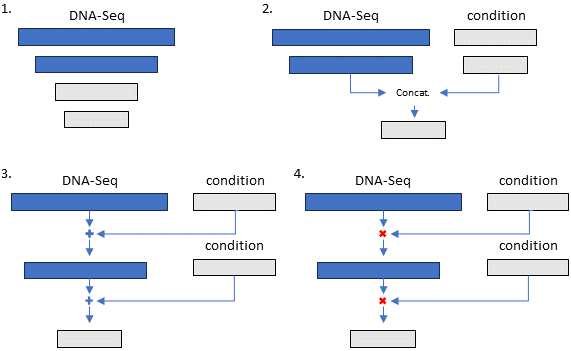

# Go-NoGo
Model files & plots can be found in models/result dir. 
If you wish to run it again, first run train_all.py and then test_all.py.
It is also possible to run and test individual models by running their respective python files.

